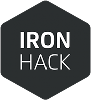

# Dev Day

## Ironhack Project #3
From March to June 2018 I attended a **Full Stack Web Development Bootcamp** in Paris with [Ironhack](http://www.ironhack.com/en).

The program was very dense yet well structured and I learnt the following tech stack & tools:
- Angular 5
- Node.js
- MongoDB
- Mongoose
- Express.js
- Javascript & Typescript
- HTML 5 / CSS 3
- GitHub
- Bash CLI

Dev Day is the second of three projects I did during the bootcamp. It was created with my fellow Ironhackers @LazerLight and @LPsola, hope you enjoy it!

### [>>Here's the app!](https://dev-day33.herokuapp.com/)

## Context
The 3rd project happened after five weeks of learning. At this point, we had covered:
- advanced HTML 5 & CSS 3 manipulation, some animations
- advanced JS manipulations
- various APIs integration (Google Maps, Trello, GitHub, etc.)
- Handlebars
- Heroku app hosting platform
- front-end stack:
  - Angular.io (latest version)
  - front and back-end connection
- back-end stack:
  - Node.js 
  - Express.js
  - MongoDB
  - Mongoose

The insctructions were to create an app that would:
- involve as much as possible the technologies learnt so far
- actually be useful :)

## What is the app about?
By the end of the bootcamp we realized us developers actually have (at least) two jobs:
1. actually do what we do, which is writing code and making incredible products
2. working in teams with other developers, and actually organize so we don't cross each others or break somebody's work

Those two main jobs, combined, actually require us to use a big bunch of apps and services to stay updated and in sync. Juggling through them all could quickly become confusing.

### This is why we created Dev Day
Dev Dav is an app that basically brings together Trello and GitHub to provide you with the most important information from both platforms.

Upon loging in (GitHub is the only option), you're prompted to authorize Trello. When you do, the app retrieves info from it and shows all the active boards on your account. Entering one will present your with a simple interface showing some basic info, like:
- the members of the board
- a couple GitHub feeds like pull requests, issues and pushes
- a button that says "start your day"

Clicking on the button launches a chatbot interface that will get you started through your day. It retrieves all the cards available in your Trello backlog and asks you which ones you'd like to work on today. It takes into account the complexity of each chosen task, ends the process when you reach an approximated 8 hours work load and redirects you to the project page.

> If you check your actual Trello, you will see the tasks you chose were actually moved from the backlog to the "doing" list, and were assigned to you.

Then on the project page, the dashboard will now display a list of the tasks at hand, with the possibility to comment them and check their info. When you finish one, simply clicking on "Move to done" pushes it from the "doing" to the "done" list, and disapears from your Dev Dav dashboard so it's not cluttered with unnecessary information.

## How does the tech work under the hood?
At first, since we didn't have any experience with the Trello API, we set our MVP to work with a regular back-end using MongoDB: we had users, projects, lists and cards models. We implemented GitHub connect and feeds and got the whole thing running fine.

Then, we switched from the regular back-end to the Trello API, to feed our dashboards and chatbots with real trello boards data. It took us a little while to figure out how to properly request and redirect data, but eventually it worked fine and everyone from the bootcamp could start using our app with their own data!

For the styling, we used a combination of Materialize for Angular, and native hand-written CSS.

## Summary
This was our last, obviously most complex but also most exciting project. We had to make everything we learnt so far work together properly, make the right combinations choices and setups and not break everybody else's code while implementing our features!

Hope you enjoyed using it, and don't hesitate to give me any (constructive) feedback!
